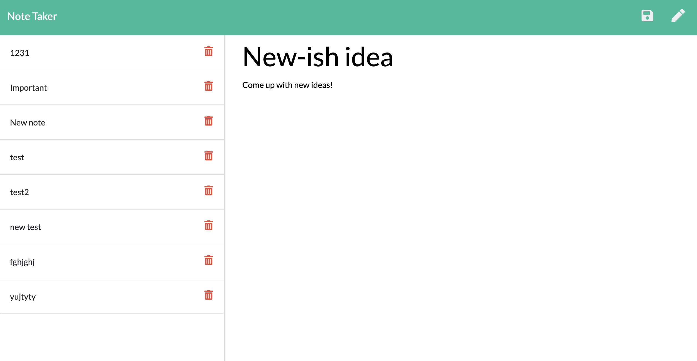

# Express.js Note Taker

* [Description](#YourTask)
* [User Story](#UserStory)
* [Installation](#Installation)
* [Contributors](#Contributors)
* [Screenshot](#Screenshot)
* [Contact](#Contact)
* [License](#License)

# Description

This application will use an Express.js back end and will save and retrieve note data from a JSON file.

# User Story

As a user
I want to be able to write and save notes
So that I can organize my thoughts and keep track of tasks I need to complete.

# Installation

[Note Taker App](https://notetakerheartbreaker.herokuapp.com/)

# Contributors

Matthew Elliott

# Screenshot

# Contact

[Github](https://github.com/MatteoThomas)

[Email](mailto:djmatteo2@gmail.com)

# License

